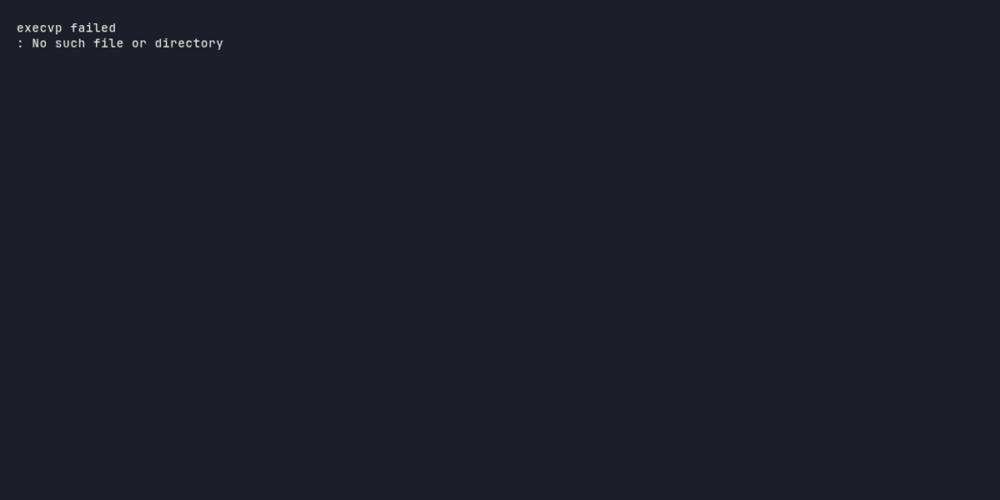

# tickerflow

**One `await fetch()` call. Crypto, stocks, forex. Zero API keys. Automatic provider fallback.**

[](https://github.com/FaustoS88/Tickerflow/actions/workflows/ci.yml)
[](https://pypi.org/project/tickerflow/)

[](https://www.python.org/)
[](LICENSE)
[](https://github.com/FaustoS88/Tickerflow)

---

```python
from tickerflow import fetch

candles = await fetch("BTCUSDT")   # crypto  → Binance → CoinGecko → Kraken → KuCoin → yfinance
candles = await fetch("AAPL")      # stocks  → yfinance → Tiingo → Finnhub
candles = await fetch("EURUSD")    # forex   → yfinance → Finnhub
```

One function. Any ticker. Any asset class. If the first provider fails, the next one picks up — automatically. No API keys needed for basic use.



## Install

```bash
pip install tickerflow
```

Extras for power users:

```bash
pip install tickerflow[pandas]   # DataFrame output
pip install tickerflow[serve]    # self-hosted API server
pip install tickerflow[chart]    # terminal charts
pip install tickerflow[ai]       # Pydantic AI integration
pip install tickerflow[all]      # everything
```

## Quick Start

```python
import asyncio
from tickerflow import fetch

async def main():
    # Fetch 10 daily candles — provider is auto-selected
    candles = await fetch("BTCUSDT", interval="1d", limit=10)
    for c in candles[-3:]:
        print(f"{c.time}  O:{c.open:.2f}  H:{c.high:.2f}  L:{c.low:.2f}  C:{c.close:.2f}")

    # Want a DataFrame instead? One flag.
    df = await fetch("AAPL", interval="1d", limit=30, as_dataframe=True)
    print(df.describe())

asyncio.run(main())
```

## CLI

```bash
# Auto-routes to the best provider
tickerflow fetch BTCUSDT 1d 10

# Force a provider
tickerflow fetch EURUSD 1d 20 --provider yfinance

# Output formats
tickerflow fetch AAPL 1d 10 --csv
tickerflow fetch AAPL 1d 10 --json

# Terminal chart — screenshot-worthy
tickerflow chart BTCUSDT 1d 30

# Self-hosted market data API
tickerflow serve --port 8000
```

## Terminal Chart

Render OHLCV data directly in your terminal with `tickerflow chart`:

```bash
tickerflow chart BTCUSDT 1d 30
```

Displays a price chart with close/high/low lines and a volume subplot. Green for up, red for down. Fits your terminal width automatically.

Requires: `pip install tickerflow[chart]`

## Self-Hosted API

One command starts a FastAPI server with live market data endpoints:

```bash
tickerflow serve --port 8000
```

Then:

```bash
curl localhost:8000/ohlcv/BTCUSDT?interval=1d&limit=5
curl localhost:8000/providers/AAPL
curl localhost:8000/health
```

Returns structured JSON — plug it into any frontend, dashboard, or automation. No rate limit, no vendor lock-in, runs on your machine.

Requires: `pip install tickerflow[serve]`

## DataFrame Output

90% of Python finance users want a DataFrame. One flag:

```python
df = await fetch("BTCUSDT", interval="1d", limit=30, as_dataframe=True)
print(df.describe())
```

Returns a `pandas.DataFrame` with columns `time` (UTC datetime), `open`, `high`, `low`, `close`, `volume`.

Requires: `pip install tickerflow[pandas]`

## Provider Routing

The router automatically detects asset class from the symbol and tries providers in order. If one fails, the next picks up.

```
BTCUSDT  →  Binance  →  CoinGecko  →  Kraken  →  KuCoin  →  yfinance
AAPL     →  yfinance  →  Tiingo (daily/weekly)  →  Finnhub
WM.TO    →  yfinance  →  Finnhub
EURUSD   →  yfinance  →  Finnhub
```

| Provider  | Latency     | Key required | Asset classes       |
|-----------|-------------|--------------|---------------------|
| Binance   | ~50–150 ms  | No           | Crypto              |
| KuCoin    | ~100–200 ms | No           | Crypto              |
| Kraken    | ~100–250 ms | No           | Crypto              |
| CoinGecko | ~200–400 ms | No           | Crypto              |
| yfinance  | ~300–800 ms | No           | Stocks, Forex, Crypto |
| Tiingo    | ~200–400 ms | Yes (free)   | Stocks, ETFs        |
| Finnhub   | ~200–500 ms | Yes (paid)   | Stocks, Forex       |

## Supported Intervals

`1m` · `5m` · `15m` · `1h` · `4h` · `1d` · `1w`

## Caching

Responses are cached in memory with interval-aware TTLs:

| Interval | TTL   |
|----------|-------|
| `1m`     | 30s   |
| `5m`     | 2 min |
| `15m`    | 5 min |
| `1h`     | 30 min |
| `4h`     | 2h    |
| `1d`     | 4h    |
| `1w`     | 24h   |

Disable: `OHLCV_CACHE_ENABLED=false`

## Pydantic AI Integration

Use tickerflow as a tool in your [Pydantic AI](https://github.com/pydantic/pydantic-ai) agents:

```python
from pydantic_ai import Agent
from tickerflow import fetch

agent = Agent("openai:gpt-4o", instructions="You are a market analyst.")

@agent.tool
async def fetch_market_data(ctx, symbol: str, interval: str = "1d", limit: int = 30) -> str:
    candles = await fetch(symbol, interval=interval, limit=limit)
    if not candles:
        return f"No data for {symbol}"
    last = candles[-1]
    return f"{symbol}: O={last.open:.2f} H={last.high:.2f} L={last.low:.2f} C={last.close:.2f}"
```

See [`examples/pydantic_ai_agent.py`](examples/pydantic_ai_agent.py) for a complete working agent.

Requires: `pip install tickerflow[ai]`

## Why This Exists

I built tickerflow because I was tired of wiring up different API clients for crypto vs stocks vs forex. I wanted one async `fetch()` call that handles everything — and falls back automatically when a provider is down.

This is the market data layer for my [Pydantic AI Pine Script Expert](https://github.com/FaustoS88/Pydantic-AI-Pinescript-Expert) agent. If you're building AI agents, trading bots, or data pipelines that need multi-asset OHLCV data with zero configuration — this is it.

## Examples

See [`examples/`](examples/) for runnable scripts:

- [`basic_fetch.py`](examples/basic_fetch.py) — fetch candles for crypto, stock, and forex
- [`multi_provider.py`](examples/multi_provider.py) — inspect provider chains and observe fallback
- [`pandas_output.py`](examples/pandas_output.py) — DataFrame output for quick analysis
- [`pydantic_ai_agent.py`](examples/pydantic_ai_agent.py) — AI agent with market data tools

## Roadmap

**v0.2.0** (current)
- pandas DataFrame output
- `tickerflow serve` — self-hosted FastAPI market data API
- `tickerflow chart` — terminal candlestick charts
- Pydantic AI integration example

**Planned**
- OKX and Bybit providers
- WebSocket streaming
- Async context manager support

## Contributing

See [CONTRIBUTING.md](CONTRIBUTING.md) for development setup, how to add providers, and PR guidelines.


## License

MIT
